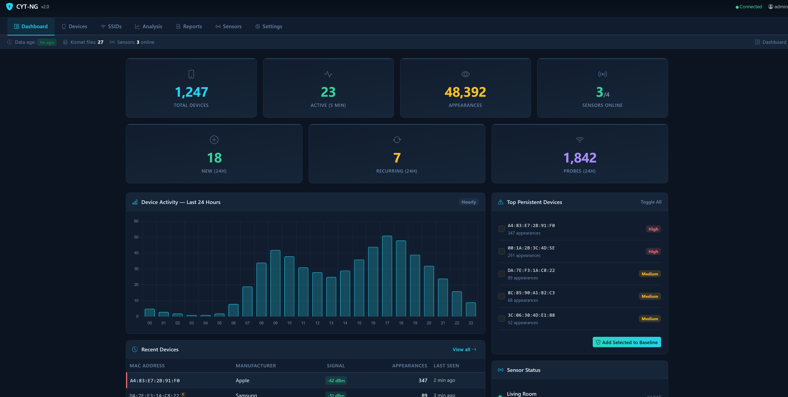
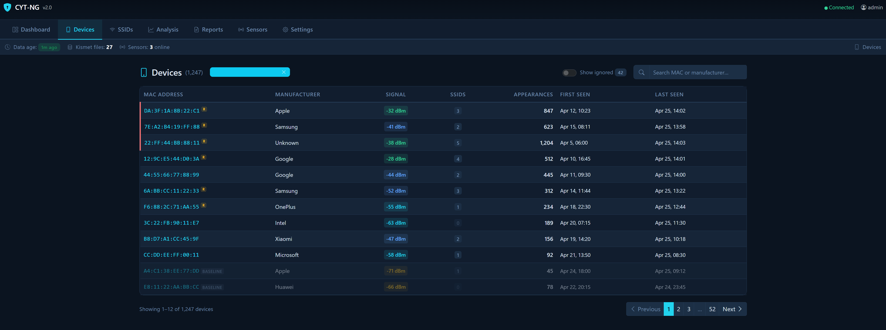
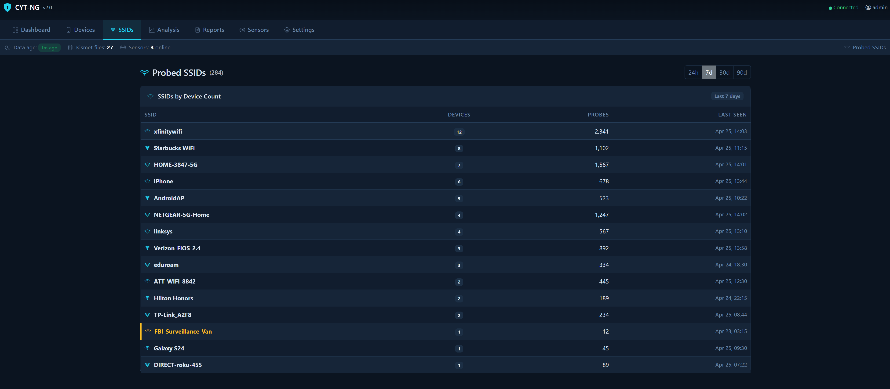
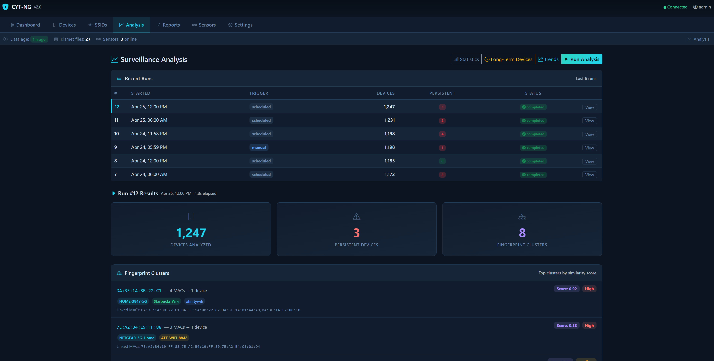
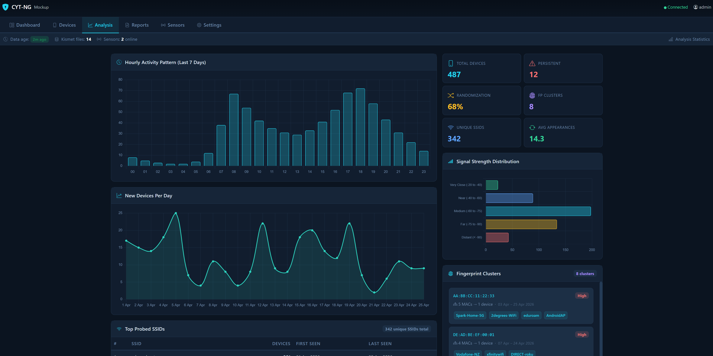
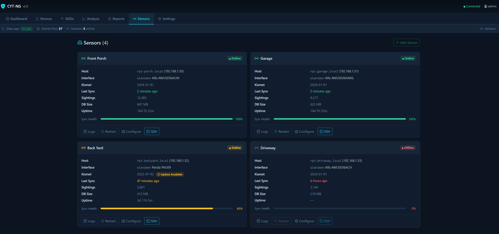

<div align="center">



# Chasing Your Tail — Next Generation

**Know who keeps showing up.**

CYT-NG is a centralized Wi-Fi surveillance detection system that monitors your home, office, or any fixed location for recurring wireless devices. Distributed Raspberry Pi sensors capture probe requests in real time and feed them into an analysis engine that spots patterns humans would miss — revealing who keeps coming back and how often.

[](https://python.org)
[](https://flask.palletsprojects.com)
[](https://docs.docker.com/compose/)
[](LICENSE)

</div>

---

## The Problem

Every wireless device — phone, laptop, smartwatch — constantly broadcasts **probe requests** looking for known networks. Those broadcasts include a unique identifier and often the names of networks the device has connected to before. Anyone sitting outside your home or workplace with a Wi-Fi adapter can passively catalog every device that comes and goes.

CYT-NG turns that same technique into a **defensive tool**. Deploy sensors at fixed locations — your home, your office, your vehicle — and let the system build a picture of who keeps appearing nearby. Baseline your own devices, and anything that shows up repeatedly without explanation gets flagged.

> **Looking for the portable version?** The original [Chasing Your Tail](https://github.com/ArgeliusLabs/Chasing-Your-Tail-NG) was designed for mobile use — carry a sensor with you and detect if the same device follows you from place to place. CYT-NG takes a different approach: **fixed-location monitoring** with centralized analysis, multi-sensor correlation, and a full web UI.

## How It Works

```
┌──────────────────┐     ┌──────────────────┐
│  RPi Sensor #1   │     │  RPi Sensor #2   │
│  (Kismet + WiFi) │     │  (Kismet + WiFi) │
└────────┬─────────┘     └────────┬─────────┘
         │  SMB sync every 5 min  │
         └──────────┬─────────────┘
                    ▼
         ┌─────────────────────┐
         │   Synology NAS      │
         │  ┌───────────────┐  │
         │  │   cyt-nginx   │  │  ← TLS reverse proxy
         │  │  (port 443)   │  │
         │  └───────┬───────┘  │
         │          ▼          │
         │  ┌───────────────┐  │
         │  │    cyt-web    │  │  ← Flask + SocketIO
         │  │  (Gunicorn)   │  │
         │  └───────┬───────┘  │
         │          ▼          │
         │  ┌───────────────┐  │
         │  │  Analysis     │  │  ← Fingerprinting, persistence
         │  │  Engine       │  │    scoring, pattern detection
         │  └───────────────┘  │
         └─────────────────────┘
```

1. **Sensors listen.** Raspberry Pis with monitor-mode Wi-Fi adapters run [Kismet](https://www.kismetwireless.net/) to capture probe requests within range.
2. **Data syncs automatically.** Each sensor pushes `.kismet` SQLite databases to a Synology NAS share on a timer.
3. **The engine ingests.** A background scheduler reads new Kismet files, deduplicates devices, and builds an appearance timeline.
4. **Analysis runs.** SSID fingerprinting (Jaccard similarity) clusters MAC-randomized devices. Persistence scoring flags devices that appear too often across too many time windows.
5. **You get answers.** The web UI shows dashboards, device timelines, signal analysis, and downloadable reports.

---

## Features

### Real-Time Dashboard

Live device counts, 24-hour activity sparklines, sensor health, and persistent device alerts — all updating via WebSocket.


### Device Browser

Search, sort, and drill into any detected device. See full appearance timelines, probed SSIDs, signal strength history, and manufacturer info. Filter by signal range to focus on close-proximity devices.



### SSID Intelligence

Browse all probed SSIDs across your sensor network. See which devices are looking for the same networks — a strong indicator they belong to the same person.



### Surveillance Analysis

One-click analysis runs SSID fingerprinting with configurable Jaccard thresholds to cluster MAC-randomized devices that share probe pools. Persistence scoring flags devices that keep coming back.



### Statistics Dashboard

Eight interactive panels covering hourly activity patterns, new device trends, top probed SSIDs, signal strength distribution, fingerprint clusters, dwell time analysis, and multi-sensor coverage overlap.



### Sensor Management

Add, provision, and monitor Raspberry Pi sensors directly from the web UI. The 11-step automated provisioner handles everything over SSH — from installing Kismet to mounting NAS shares — with live progress streaming.



### Reports & KML Export

Download analysis reports and KML files for mapping device locations in Google Earth. GPS correlation powered by optional WiGLE API integration.

### Trends & Long-Term Tracking

Daily device and appearance trends over configurable time ranges. Long-term device tracking identifies persistent watchers across days, weeks, and months.

---

## Quick Start

### What You Need

| Component | Details |
|-----------|---------|
| **NAS** | Synology (or any Docker host) with Docker Compose |
| **Sensor(s)** | Raspberry Pi + monitor-mode Wi-Fi adapter (e.g., Alfa AWUS036ACM) |
| **Network** | SMB share accessible from sensors to NAS |

### Deploy in 3 Steps

```bash
# 1. Clone to your NAS
git clone https://github.com/perryd990311/CYT-NG.git
cd CYT-NG

# 2. Configure
cp .env.example .env
# Edit .env with your SECRET_KEY and optional OAuth2/WiGLE credentials

# 3. Launch
docker compose up -d
```

Open `https://your-nas-ip` and create your first admin account.

> **Full setup guides** — including NAS configuration, sensor hardware, and Synology SSO — are in the [docs/](docs/) folder.

---

## Documentation

| Guide | Description |
|-------|-------------|
| [Installation](docs/installation.md) | Docker deployment on Synology NAS |
| [Sensor Setup](docs/sensor-setup.md) | Raspberry Pi hardware, Kismet, and provisioning |
| [Synology SSO](docs/synology-sso.md) | OAuth2 single sign-on with DSM or local auth |
| [Configuration](docs/configuration.md) | `config.json` and `.env` reference |
| [Security](docs/security.md) | Security model and hardening details |

---

## Tech Stack

| Layer | Technology |
|-------|-----------|
| **Backend** | Python 3.12, Flask, Flask-SocketIO, SQLAlchemy, APScheduler |
| **Frontend** | HTMX, Chart.js, Bootstrap 5 (dark theme) |
| **Database** | SQLite (CYT database) + Kismet SQLite files |
| **Infrastructure** | Docker Compose, Gunicorn + gevent, Nginx (TLS) |
| **Auth** | Synology DSM OAuth2 SSO + local bcrypt fallback |
| **Security** | Fernet encryption, parameterized SQL, rate limiting, CSP headers |

---

## Project Structure

```
cyt/                Analysis engine (Python package)
  ├── models.py              SQLAlchemy models
  ├── kismet_reader.py       Incremental .kismet ingestion
  ├── fingerprint.py         SSID Jaccard similarity clustering
  ├── surveillance_detector.py  Persistence scoring
  ├── sensor_provisioner.py  SSH-based RPi setup
  └── tasks.py               Background scheduler jobs

web/                Flask web application
  ├── app.py                 App factory
  ├── routes/                Blueprints (dashboard, devices, analysis, sensors, settings, auth, reports)
  ├── templates/             Jinja2 + HTMX partials
  ├── auth/                  OAuth2 + local login
  └── static/                CSS, JS

docker/             Docker build files
nginx/              TLS reverse proxy config
sensor/             RPi provisioning scripts
docs/               Setup and configuration guides
```

---

## Authors

**@perryd990311**

## License

[MIT](LICENSE)

## Disclaimer

CYT-NG is intended for legitimate security research, network administration, and personal safety purposes. Users are responsible for complying with all applicable laws in their jurisdiction regarding wireless monitoring.

